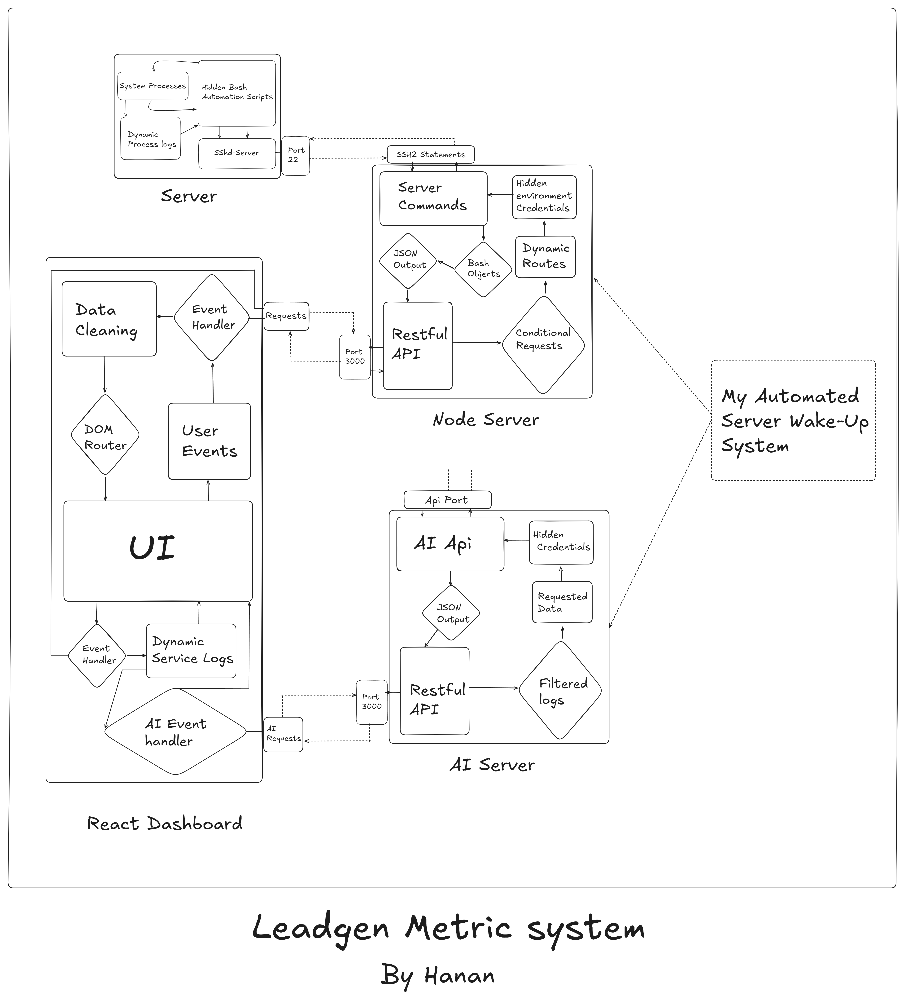
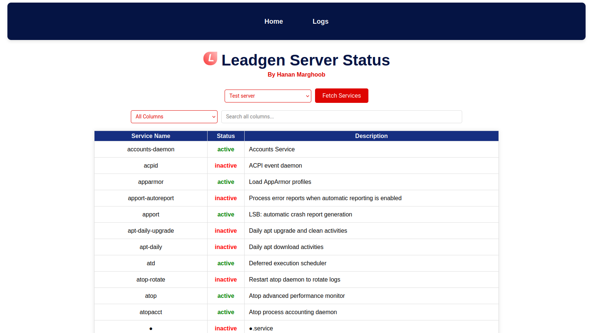
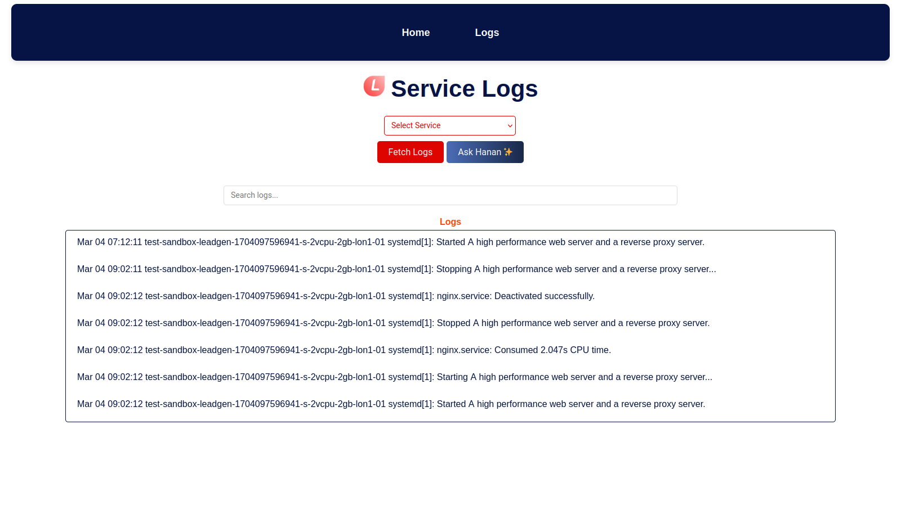
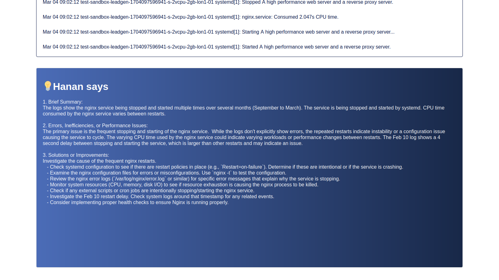

# Server Metrics System  

A **custom server metrics & monitoring system** with built-in **AI-powered** features, developed during my internship at **Mountech** for **Leadgen’s** server monitoring and performance analysis.  

> **Due to the sensitivity of the company's information, I cannot disclose the source code or the deployment link.**  

  

## Overview  

This system monitors **all active and inactive services** running on the server, providing a **centralized dashboard** for easy management and analysis.  

## Dashboard Features  

- Displays all system services, including their statuses.  
- Allows users to search through services using various filters.  

  

## Logs Section  

- Users can view and navigate through **individual logs** of different services.  
- Logs are **parsed and presented** in a structured, readable format.  

  

## AI-Powered Log Analysis  

Once the logs are fetched, an **AI agent** named **"ASK Hanan"** analyzes them to:  

- Summarize hundreds of log lines efficiently.  
- Detect errors and highlight critical issues.  
- Suggest countermeasures for detected problems.  

  

## User-Friendly Monitoring  

This system ensures that **even non-technical users** can monitor their servers and services **without requiring extensive technical expertise**.  
